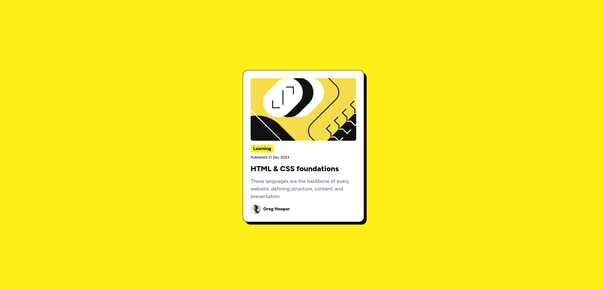

# Frontend Mentor - Blog preview card solution

This is a solution to the [Blog preview card challenge on Frontend Mentor](https://www.frontendmentor.io/challenges/blog-preview-card-ckPaj01IcS).

## Table of contents

- [Overview](#overview)
  - [Screenshot](#screenshot)
  - [Links](#links)
- [My process](#my-process)
  - [Built with](#built-with)
- [Author](#author)

**Note: Delete this note and update the table of contents based on what sections you keep.**

## Overview

### Screenshot

### Links

- Solution URL: [https://www.frontendmentor.io/solutions/blog-preview-card-nj35l4G4T1](https://www.frontendmentor.io/solutions/blog-preview-card-nj35l4G4T1)
- Live Site URL: [https://blog-preview-card-10.vercel.app/](https://blog-preview-card-10.vercel.app/)

## My process

### Built with

- React
- Typescript
- Tailwind

## Author

- Frontend Mentor - [@krutagna10](https://www.frontendmentor.io/profile/krutagna10)
